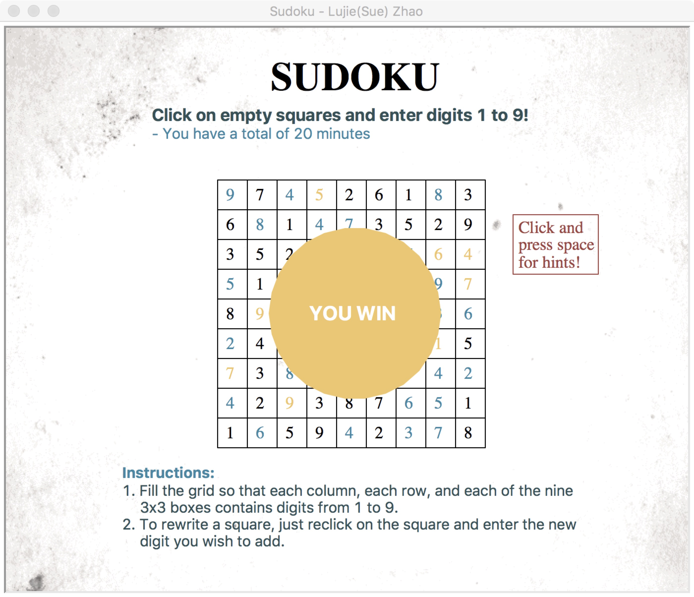

# CS1114-Sudoku
 Final project for CS1114 class

The objective of this project is to create a program that generates a Sudoku game. This project can be improved and feasible for all students in the future. It takes user inputs (digits 1 to 9), examines them, and informs the user after he/she completed the game correctly. The program allows user to change his/her inputs before the time limit (20 mins). However, the digits that were originally generated cannot be changed. 

After the time limit, the project will inform the user that he/she has lost the game. The user can also press space to see hints to complete the game. The project was all completed by now. Some extra features include offering different hardness levelss and giving hints for the user.

An example layout of the game is shown below:

